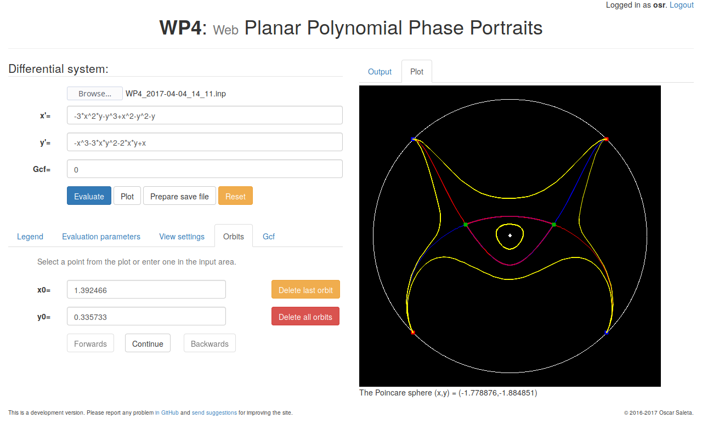

[comment]: #  (This file is part of WP4 (http://github.com/oscarsaleta/WP4))
[comment]: #  ( )
[comment]: #  (Copyright (C) 2016  O. Saleta)
[comment]: #  ( )
[comment]: #  (WP4 is free software: you can redistribute it and/or modify)
[comment]: #  (it under the terms of the GNU Lesser General Public License as published)
[comment]: #  (by the Free Software Foundation, either version 3 of the License, or)
[comment]: #  ((at your option) any later version.)
[comment]: #  ( )
[comment]: #  (This program is distributed in the hope that it will be useful,)
[comment]: #  (but WITHOUT ANY WARRANTY; without even the implied warranty of)
[comment]: #  (MERCHANTABILITY or FITNESS FOR A PARTICULAR PURPOSE.  See the)
[comment]: #  (GNU Lesser General Public License for more details.)
[comment]: #  ( )
[comment]: #  (You should have received a copy of the GNU Lesser General Public License)
[comment]: #  (along with this program.  If not, see <http://www.gnu.org/licenses/>.)

#  WP4, web version of P4 (Polynomial Planar Phase Portraits)

*This project is still in development.*

The aim of this project is to create a web version of <a href="htpps://github.com/oscarsaleta/P4">P4</a> with limited functionality and host it in a public server, in order to make the P4 software available to a wider user base (e.g. for users that do not have Maple).

## Acknowledgements

This project would not be possible without the support of Joan Torregrossa, and the original authors of P4: J. C. Artés, C. Herssens, P. De Maesschalck, F. Dumortier and J. Llibre.

## Screenshots

### Output view

### Plot view

### Login widget

### Extra evaluation parameters (registered users only)

### View configuration (registered users only)

### Orbit integration (registered users only)

## Want to try it locally?

**Requirements:**

* Compilation: **Wt library** (if you need the `wtfcgi` connector, you probably need to build Wt from source) and **CMake**.
* Execution: **P4** installed in `/usr/local/p4` (see <a href="https://github.com/oscarsaleta/P4#installation">P4 repository</a> for install instructions) [1], **Maple**.

**Step by step:**

* Clone this repository,
* Build the source with CMake (set `WT_CONNECTOR`),
* Change the name of the server configuration file: `cp wt_config.xml.example wt_config.xml`, and edit it if needed (for FCGI builds, `num-threads` should be more than 1).
* Run the *WP4.wt* executable using `--docroot` and any other necessary argument (see scripts *debug* or *release* for example wthttp commands).
* Use a web browser to test the web app.

[1] Actually, only the separate executables *lyapunov* and *separatrices* are needed from the P4 suite. WP4 does not need or use the P4 Qt application itself for working.
