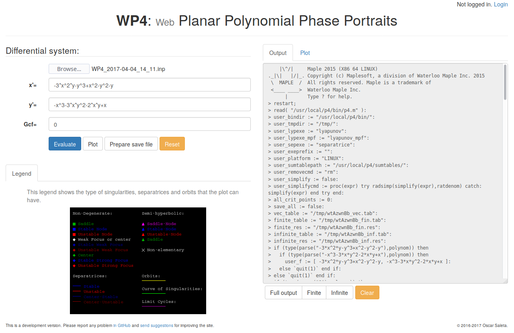
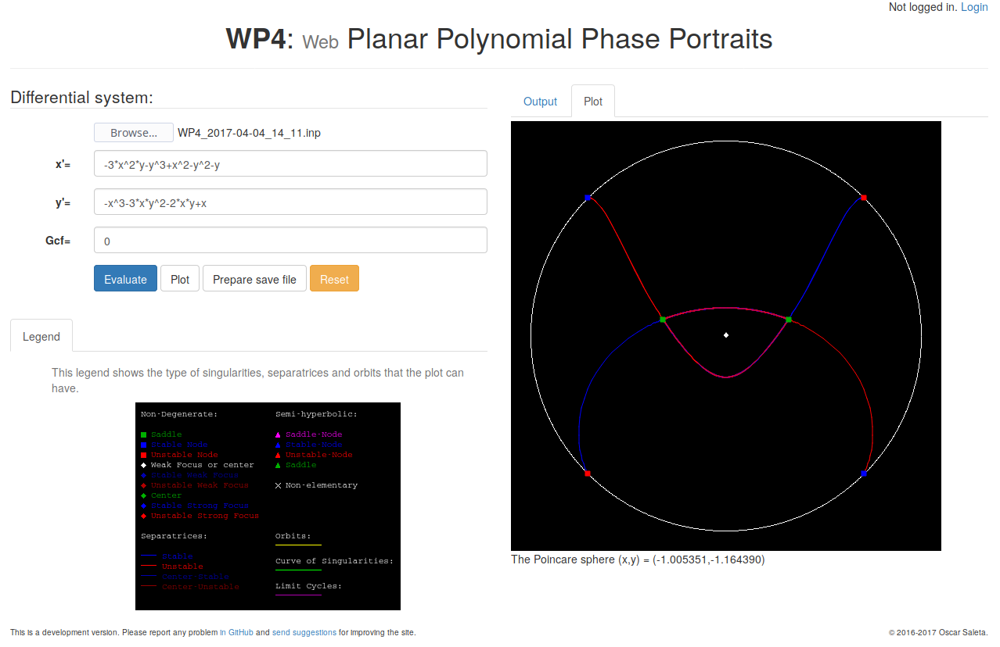

# WP4, web version of P4 (Polynomial Planar Phase Portraits)

*This project is in an early development stage.*

The aim of this project is to create a web version of <a href="htpps://github.com/oscarsaleta/P4">P4</a> with very limited functionality and host it in a public server, in order to make the P4 software available to a wider public (e.g. for users that do not have Maple).

## Screenshots

### Output view

### Plot view

### Login widget

### Extra evaluation parameters (registered users only)

### View configuration (registered users only)

### Orbit integration (registered users only)

## Want to try it locally?

**Requirements:**

* Compilation: **Wt library** (`sudo apt install witty witty-dev` for Ubuntu) and **CMake** (`sudo apt install cmake`)
* Execution: **P4** installed as root (see <a href="https://github.com/oscarsaleta/P4#installation">P4 repository</a> for install instructions) [1], **Maple**.

**Step by step:**

* Clone this repository: `git clone https://github.com/oscarsaleta/WP4.git` and enter its directory: `cd WP4`,
* Create a build directory: `mkdir build && cd build`,
* Run CMake to generate the Makefiles: `cmake ..`,
* If no errors appeared, a *Makefile* file should have been created. Run `make` to compile (you can run `make -j4`, for example, if your computer has 4 cores).
* If no errors appeared, the Wt application is compiled and ready to run. Change dir to the root directory of the repository (`cd ..`),
* Change the name of the server configuration file: `cp wt_config.xml.example wt_config.xml`, and edit it.
    - Uncomment the properties `auth-mail-sender-name` and `auth-mail-sender-address`, and set the address to a valid mail address. This enables email verification/password recovery.
* Run the *WP4* script: (`./WP4`).
* Now open a web browser and go to this address: `[0::0]:8080` to try out WP4.

[1] Actually, only the separate executables *lyapunov* and *separatrices* are needed from the P4 suite. WP4 does not need or use the P4 Qt application itself for working.
