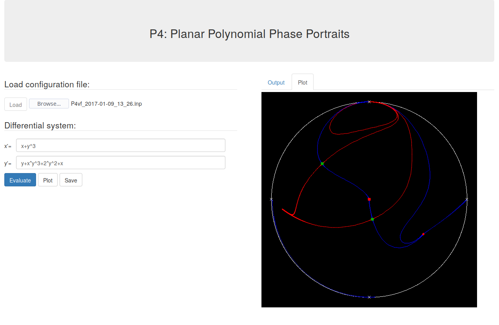

# P4Web, web version of P4 (Polynomial Planar Phase Portraits)

*This project is in an early development stage.*

The aim of this project is to create a web version of <a href="htpps://github.com/oscarsaleta/P4">P4</a> with very limited functionality and host it in a public server, in order to make the P4 software available to a wider public (e.g. for users that do not have Maple).

